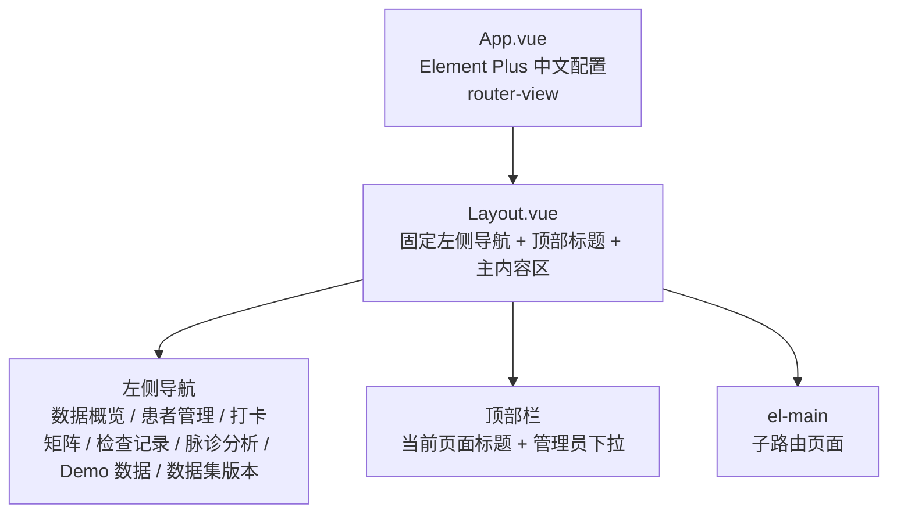
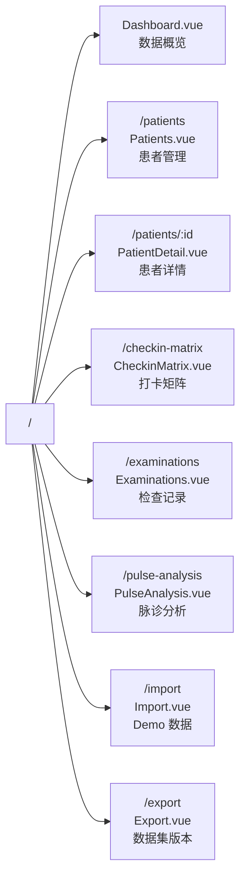
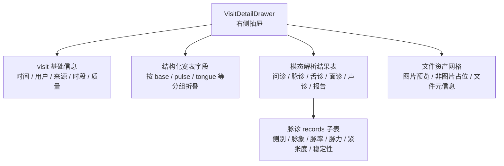
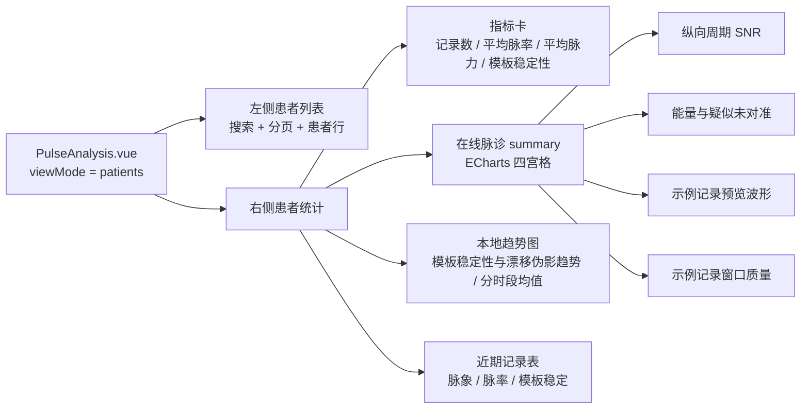
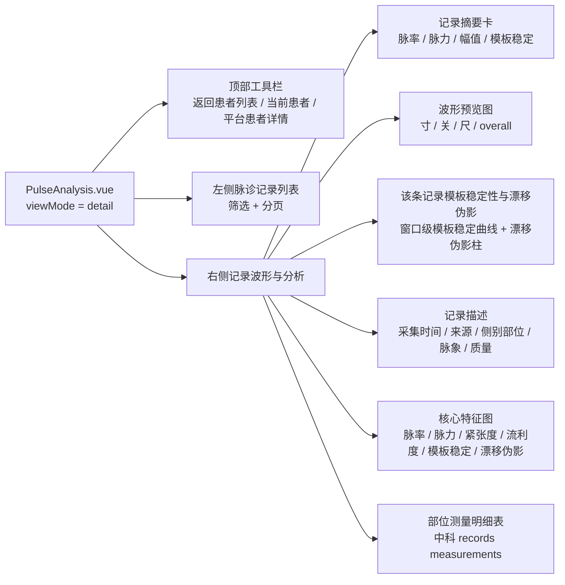
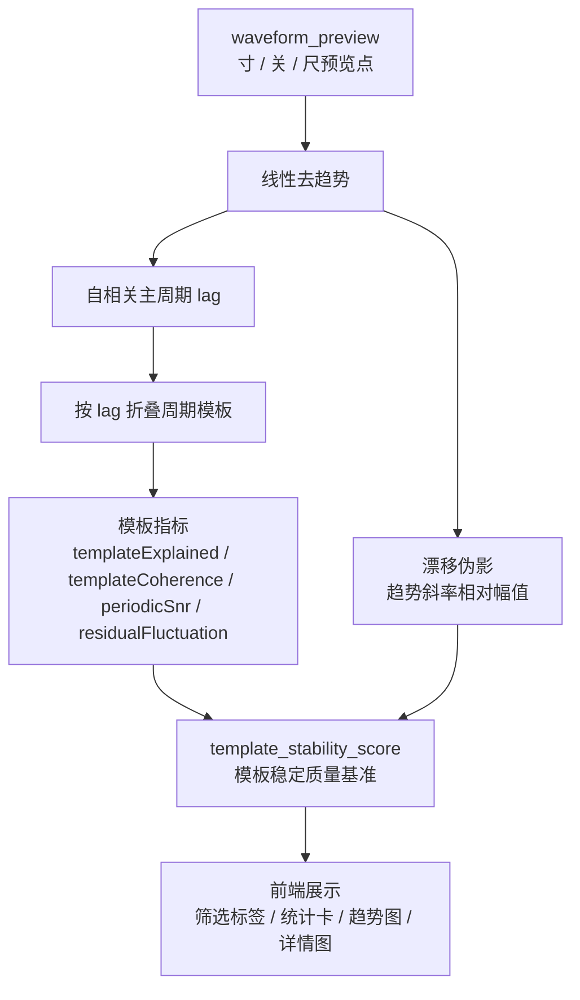

# 前端页面结构图

更新时间：2026-05-24

本文档描述当前 `frontend/src` 的页面结构、主导航、通用抽屉和脉诊分析页面内部层级。前端采用 Vue 3、Vue Router、Element Plus 和 ECharts。

## 1. 应用骨架

## 2. 路由与页面

## 3. 页面职责

| 页面 | 主体结构 | 关键展示 |
| --- | --- | --- |
| `Dashboard.vue` | 指标卡 + 覆盖率/质量图 + 脉诊质量/设备适配面板 + 最近 visit 表 | 平台总体样本、脉诊质量构成、患者设备适配风险排名、寸关尺疑似未对准热力图 |
| `Patients.vue` | 搜索筛选 + 患者表格 | 患者基础信息、visit 数、模态覆盖率、质量状态、进入详情 |
| `PatientDetail.vue` | 患者概况 + 脉诊趋势 + 模态统计 + visit 时间线 | 单患者纵向随访；可打开 visit 详情抽屉 |
| `CheckinMatrix.vue` | 患者/日期/时段矩阵 | 早中晚打卡覆盖、缺失和质量状态 |
| `Examinations.vue` | 筛选条 + visit 表格 | 多模态检查记录、模态覆盖、质量标签；可打开 visit 详情抽屉 |
| `PulseAnalysis.vue` | 患者列表页 + 患者脉诊详情页 | 脉诊下游研究分析、个人基线模板、波形模板稳定性、漂移伪影、窗口级记录质量 |
| `Import.vue` | 数据状态表 + 入库操作面板 | 本地 demo 数据解析、同步和宽表重建入口 |
| `Export.vue` | 数据集构建表单 + 版本列表 + 版本摘要 | 标准化数据集版本管理 |

## 4. 通用 Visit 详情抽屉

`VisitDetailDrawer.vue` 被 `PatientDetail.vue` 和 `Examinations.vue` 复用。

## 5. 脉诊分析页面结构

`PulseAnalysis.vue` 有两个视图模式：患者总览和患者脉诊详情。

### 5.1 患者总览

### 5.2 患者脉诊详情

## 6. 脉诊质量基准

当前前端脉诊质量展示优先使用“波形模板稳定性”，缺少波形时才回退原始 `stability_score`。

## 7. 页面与接口关系

| 页面 | 主要接口 |
| --- | --- |
| Dashboard | `/api/demo/summary`、`/api/demo/visits`、`/api/pulse/analysis/phase1-summary`、`/api/pulse/analysis/device-fit-overview` |
| Patients | `/api/demo/users` |
| PatientDetail | `/api/demo/users/:id`、`/api/demo/visits/:id` |
| CheckinMatrix | `/api/demo/checkin-matrix` |
| Examinations | `/api/demo/visits`、`/api/demo/visits/:id` |
| PulseAnalysis | `/api/demo/users`、`/api/demo/pulse/records`、`/api/pulse/analysis/user-summary`、`/api/pulse/analysis/period-consistency`、`/api/pulse/analysis/personal-baseline` |
| Import | `/api/ingest/*` |
| Export | `/api/demo/datasets/*` |

## 8. 当前注意事项

- `PulseAnalysis.vue` 同时存在后端在线 summary 和前端本地模板稳定性计算：后端 summary 用于患者总览四宫格，前端本地计算用于列表、趋势、记录详情和模板稳定质量基准。
- 患者 summary 的个人基线模板来自阶段七离线产物；长期疑似未对准通道与高质量样本不足通道仅展示排除原因，不参与个人模板绘制。
- 当前本地模板稳定性仍基于 `waveform_preview` 预览点，不等价于完整原始波形分析；完整波形接入后应将相同指标迁移到后端统一计算。
- `VisitDetailDrawer.vue` 中脉诊 records 子表仍展示原始解析字段 `stability_score`，尚未接入模板稳定性。
