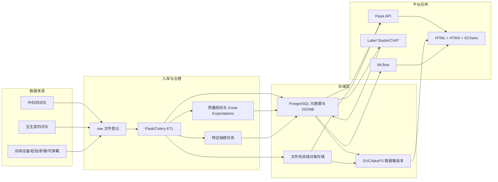

# 多模态数据展示平台总体设计

生成时间：2026-05-16

## 1. 技术选型结论

后端采用 Flask，不采用 MongoDB。平台使用 PostgreSQL 作为主数据库，使用 JSONB 保存半结构化模态数据，用文件系统或对象存储保存大文件资产。整体目标是统一整合不同平台数据，完成数据治理，并提供可直接支持机器学习和深度学习的数据集下载、版本管理、标签管理与 benchmark 管理。

### 1.1 推荐技术栈

| 层级 | 组件 | 首期用途 | 说明 |
| --- | --- | --- | --- |
| 反向代理 | Nginx | HTTPS、静态文件、API 反向代理、受控下载转发 | 不直接暴露敏感原始目录 |
| 后端 API | Flask | 平台 API、权限、页面数据接口、任务入口 | 与现有 Python/SQLAlchemy 代码兼容 |
| 数据库 | PostgreSQL | 用户、visit、模态、资产、标签、数据集、benchmark 元数据 | JSONB 支持半结构化字段，关系一致性更好 |
| ORM 与迁移 | SQLAlchemy + Alembic | 模型定义、数据库迁移 | 当前仓库已使用 SQLAlchemy |
| 文件资产 | 本地文件系统，后续可切 MinIO/S3 | 图片、PDF、wav、zip、原始 Excel/JSON | 数据库只存 URI、hash、大小和 mime type |
| 异步任务 | Celery + Redis | 导入、解析、质量检测、特征提取、数据集导出 | 避免 Flask 请求阻塞 |
| 数据质量 | Great Expectations | 入库校验、规则验证、质量报告 | 规则结果回写平台质量表 |
| 数据集版本 | DVC 或 lakeFS | 标准化数据集版本、manifest、快照追踪 | 首期建议 DVC，规模扩大后再评估 lakeFS |
| 标注平台 | Label Studio | 文本、图片、音频、多模态标签 | 首期集成导入导出，不重造完整标注系统 |
| 图像标注扩展 | CVAT | 舌图、面图分割/检测标注 | 有图像分割需求时启用 |
| 实验与 benchmark | MLflow | 模型 run、指标、artifact、benchmark 排行 | 平台保存 benchmark 定义，MLflow 保存运行细节 |
| 前端 | HTML + Bootstrap + HTMX + ECharts | 管理页、详情页、图表、局部刷新 | 不引入 Vue/React，保持部署简单 |
| 搜索扩展 | OpenSearch | 主诉、处方、报告 OCR、审计日志检索 | 非首期必需 |
| 向量检索扩展 | Qdrant | 舌图、面图、语音 embedding 检索 | 非首期必需 |
| 分析仓库扩展 | ClickHouse | 大规模 cohort 统计和质量分析 | 数据量显著变大后再引入 |

## 2. 总体架构



## 3. 核心设计原则

1. 原始记录不可覆盖：原始病例目录、文件路径、来源字段、hash、解析状态都必须保留。
2. 标准层可重算：解析规则、质量规则、特征规则必须带版本号，重算生成新结果或新快照。
3. 文件本体不进数据库：数据库只保存资产元数据和受控 URI。
4. 研究视图与审计视图区分：审计保留原始粒度，研究视图可按规则合并。
5. 训练集只从标准资产和快照生成：禁止训练脚本直接扫描原始目录。
6. 用户隐私默认脱敏：研究导出默认只给脱敏 ID，不导出姓名、手机号、原始路径和 PDF。

## 3.1 一阶段 demo 边界

一阶段目标不是建设完整自动化数据管线，而是用本地已有静态 mock 数据构造一份 demo 数据库，再由 Flask API 动态驱动前端页面。重点验证多模态数据的呈现方式、研究人员使用路径、以及下游分析模块所需的最小接口。

### 一阶段明确不做

- 不做自动化 raw -> standard 入库管线。
- 不接 Celery、Great Expectations、DVC/lakeFS、MLflow 的真实任务。
- 不做真实文件上传、批量解析和生产级权限审计。
- 不直接连接真实原始目录。
- 不做大规模数据集打包下载。

### 一阶段必须完成

- 用静态 mock 数据 seed 到 PostgreSQL，形成 `user`、`visit`、`modality_record`、`file_asset`、`quality_event`、`dataset_version` 等 demo 记录。
- 前端不直接内置 mock 数据，必须通过 Flask API 动态读取 demo 数据库。
- 完成数据总览、用户纵向随访、visit 多模态详情、资产审核、数据质量、数据集版本的页面样式与交互。
- 建立一个下游应用模块：脉诊分析。
- 通过脉诊分析模块调试后续必要 API 形态，包括筛选、聚合、横向对比、纵向趋势和单用户同槽位稳定性分析。

### 脉诊分析模块目标

脉诊分析模块作为一阶段的第一个下游应用，验证平台是否能支持研究分析工作流。

分析范围：

- 同一用户同一时段多次脉诊数据稳定性。
- 同一用户不同时段脉诊特征变化。
- 同一用户跨日期纵向趋势。
- 不同用户之间的脉诊特征差异。
- 不同来源设备之间的脉诊结果差异。
- 异常值、重复值、缺失值对分析结果的影响。

首期展示形式：

- 指标概览卡片：脉率、脉力、紧张度、流利度、波形幅值、稳定性评分。
- 单用户纵向趋势折线图。
- 早/中/晚时段特征对比图。
- 同一用户同一时段稳定性散点图或箱线图。
- 多用户特征雷达图或柱状对比图。
- 脉象记录明细表，保留来源、visit、时段、质量标签和是否纳入分析。

### 脉诊分析所需最小接口形态

一阶段先使用静态 JSON 模拟，后续 Flask API 可按同样结构提供。

| 接口 | 用途 |
| --- | --- |
| `GET /api/demo/summary` | 数据总览 |
| `GET /api/demo/users` | 用户列表和筛选 |
| `GET /api/demo/users/{user_id}/timeline` | 用户纵向随访 |
| `GET /api/demo/visits/{visit_id}` | visit 多模态详情 |
| `GET /api/demo/pulse/records` | 脉诊记录明细 |
| `GET /api/demo/pulse/user-trend` | 单用户纵向趋势 |
| `GET /api/demo/pulse/slot-stability` | 同一用户同槽位稳定性 |
| `GET /api/demo/pulse/cross-user` | 多用户横向对比 |
| `GET /api/demo/pulse/feature-drift` | 不同时段特征变化 |

### 一阶段本地运行流程

```powershell
docker compose up -d postgres
pip install -r requirements.txt
python -m backend.scripts.init_db
python -m backend.scripts.seed_demo_data
python -m backend.run
```

前端在 WSL 中运行：

```bash
cd /mnt/e/workspace/TCM_platform/frontend
npm install
VITE_API_BASE=http://localhost:5000 npm run dev -- --host 0.0.0.0
```

如果后端也在 WSL 中运行，保持 `VITE_API_BASE=http://localhost:5000` 即可；如果后端运行在 Windows 且 WSL 无法访问 `localhost:5000`，则把 `VITE_API_BASE` 改为 Windows 主机 IP。

## 4. 数据分层

### 4.1 raw 层

保存原始证据：

- 原始目录批次
- 原始 Excel/CSV/JSON/PDF/图片/wav/zip
- 文件 hash、大小、mime type、magic bytes
- 解析尝试记录
- 来源路径和相对路径

建议表：

- `raw_import_batch`
- `raw_source_record`
- `fact_file_asset`
- `raw_parse_log`

### 4.2 standard 层

保存统一业务实体：

- `dim_user`
- `dim_user_identity_map`
- `dim_name_alias_rule`
- `fact_visit`
- `fact_modality_record`
- `fact_file_asset`
- `fact_quality_event`

### 4.3 feature 层

保存可查询、可训练的稳定特征：

- `feature_questionnaire_response`
- `feature_constitution_score`
- `feature_pulse_observation`
- `feature_pulse_raw_signal`
- `feature_tongue_observation`
- `feature_face_observation`
- `feature_voice_acoustic`
- `feature_vital_sign`
- `feature_prescription_detail`

### 4.4 mart 层

保存研究和展示快照：

- `mart_user_day_panel`
- `mart_cohort_summary`
- `mart_quality_summary`
- `mart_dataset_snapshot`
- `mart_benchmark_leaderboard`

## 5. PostgreSQL 表设计补充

现有 6 张核心表继续保留。为支持数据集、标签和 benchmark，建议新增以下模块表。

### 5.1 入库批次

`raw_import_batch`

| 字段 | 说明 |
| --- | --- |
| `batch_id` | 批次 UUID |
| `source_vendor` | `zhongke` / `yushengtang` / 其他 |
| `source_batch_name` | 原始批次或目录名 |
| `source_root_uri` | 原始根路径或对象存储 URI |
| `import_status` | `pending/running/success/failed/partial` |
| `pipeline_version` | ETL 版本 |
| `rule_version` | 质量规则版本 |
| `started_at/finished_at` | 执行时间 |
| `summary_json` | 文件数、成功数、失败数等 |

### 5.2 原始记录

`raw_source_record`

| 字段 | 说明 |
| --- | --- |
| `raw_record_id` | 原始记录 UUID |
| `batch_id` | 所属批次 |
| `source_vendor` | 来源 |
| `source_visit_id` | 病例号 / TreatNumber |
| `source_record_group_id` | 中科 5 分钟聚合组或玉生堂病例目录组 |
| `raw_folder_name` | 原始目录名 |
| `raw_name` | 原始姓名 |
| `canonical_name` | 标准姓名 |
| `collected_at` | 来源采集时间 |
| `source_evidence_json` | 参与聚合的时间、文件、字段证据 |
| `quality_flags_json` | 原始粒度质量标签 |

### 5.3 质量事件

`fact_quality_event`

| 字段 | 说明 |
| --- | --- |
| `quality_event_id` | 事件 UUID |
| `entity_type` | `user/visit/modality/asset/dataset` |
| `entity_id` | 关联实体 ID |
| `quality_flag` | 标准质量标签 |
| `severity` | `info/warning/error/blocker` |
| `status` | `open/resolved/ignored` |
| `rule_version` | 规则版本 |
| `evidence_json` | 证据 |
| `created_at/resolved_at` | 时间 |

### 5.4 标签管理

`dim_label_schema`

| 字段 | 说明 |
| --- | --- |
| `label_schema_id` | 标签体系 ID |
| `name` | 标签体系名称 |
| `task_type` | `classification/regression/detection/segmentation/multilabel` |
| `target_entity_type` | `user/visit/modality/asset` |
| `labels_json` | 标签字典 |
| `schema_version` | 标签体系版本 |
| `is_active` | 是否启用 |

`fact_label_annotation`

| 字段 | 说明 |
| --- | --- |
| `annotation_id` | 标注 ID |
| `label_schema_id` | 标签体系 |
| `target_entity_type` | 标注对象类型 |
| `target_entity_id` | 标注对象 ID |
| `label_value_json` | 标签值 |
| `label_source` | `device/etl/expert/model/import` |
| `annotator_id` | 标注人 |
| `review_status` | `pending/approved/rejected/conflict` |
| `label_version` | 标签版本 |
| `created_at/updated_at` | 时间 |

### 5.5 数据集版本

`dataset_definition`

| 字段 | 说明 |
| --- | --- |
| `dataset_id` | 数据集 ID |
| `name` | 数据集名称 |
| `task_type` | 任务类型 |
| `description` | 说明 |
| `owner_id` | 创建人 |
| `created_at` | 创建时间 |

`dataset_version`

| 字段 | 说明 |
| --- | --- |
| `dataset_version_id` | 数据集版本 ID |
| `dataset_id` | 所属数据集 |
| `version_name` | 例如 `v2026.05.16.001` |
| `cohort_filter_json` | cohort、日期、来源过滤条件 |
| `modality_filter_json` | 模态组合条件 |
| `quality_filter_json` | 纳入/排除规则 |
| `label_schema_id` | 使用的标签体系 |
| `label_version` | 标签版本 |
| `split_strategy` | `by_user/by_visit/by_date/manual` |
| `split_seed` | 随机种子 |
| `manifest_uri` | manifest 文件 URI |
| `artifact_uri` | zip/parquet/jsonl 等导出物 URI |
| `dvc_rev_or_lakefs_ref` | DVC/lakeFS 引用 |
| `status` | `draft/building/ready/archived/failed` |
| `summary_json` | 样本数、用户数、模态覆盖率 |

`dataset_item`

| 字段 | 说明 |
| --- | --- |
| `dataset_item_id` | 样本 ID |
| `dataset_version_id` | 数据集版本 |
| `split` | `train/val/test/holdout` |
| `user_id` | 用户 |
| `visit_id` | visit |
| `modality_record_ids` | 模态记录 ID 列表 |
| `asset_ids` | 文件资产 ID 列表 |
| `label_json` | 快照标签 |
| `sample_manifest_json` | 单样本导出描述 |

### 5.6 Benchmark 管理

`benchmark_definition`

| 字段 | 说明 |
| --- | --- |
| `benchmark_id` | benchmark ID |
| `name` | benchmark 名称 |
| `task_type` | 任务类型 |
| `dataset_version_id` | 固定数据集版本 |
| `metric_config_json` | 指标定义 |
| `baseline_policy_json` | baseline 要求 |
| `is_public` | 是否对平台用户可见 |

`benchmark_run`

| 字段 | 说明 |
| --- | --- |
| `benchmark_run_id` | 运行 ID |
| `benchmark_id` | benchmark |
| `mlflow_run_id` | MLflow run |
| `model_name` | 模型名称 |
| `model_version` | 模型版本 |
| `submitter_id` | 提交人 |
| `metrics_json` | 指标结果 |
| `artifact_uri` | 预测文件、报告、模型等 |
| `run_status` | `running/success/failed/rejected` |
| `created_at` | 创建时间 |

## 6. 文件资产策略

详细目录、URI、命名、权限和清理规则见 `docs/标准化本地存储结构设计.md`。本节只保留总体原则。

### 6.1 首期策略

首期可使用服务器本地文件系统：

```text
storage/
  raw/
    zhongke/{batch_id}/...
    yushengtang/{batch_id}/...
  standardized/
    assets/{asset_id_prefix}/{asset_id}
  datasets/
    {dataset_id}/{version}/manifest.jsonl
    {dataset_id}/{version}/files/
  exports/
    audit/
    benchmark/
```

数据库保存：

- `storage_uri`
- `source_relative_path`
- `file_hash`
- `file_size`
- `mime_type`
- `asset_type`
- `asset_role`
- `is_training_eligible`
- `excluded_reason`

### 6.2 后续对象存储

当文件量和并发下载增加时，将 `storage_uri` 从本地路径迁移到 S3 兼容 URI：

```text
s3://tcm-platform/raw/...
s3://tcm-platform/assets/...
s3://tcm-platform/datasets/...
```

可选组件为 MinIO 或其他 S3 兼容对象存储。是否采用 MinIO 需要在部署前确认许可证和运维策略。

### 6.3 下载控制

敏感资产不直接由 Nginx 静态目录暴露。推荐流程：

1. 前端请求 Flask 下载接口。
2. Flask 校验用户权限和审计策略。
3. Flask 记录下载审计日志。
4. Flask 通过 `X-Accel-Redirect` 交给 Nginx 内部路径传输，或签发短期下载 URL。

## 7. Flask 后端模块

建议目录结构：

```text
backend/
  app/
    __init__.py
    config.py
    extensions.py
    database.py
    models/
      identity.py
      visit.py
      modality.py
      asset.py
      quality.py
      label.py
      dataset.py
      benchmark.py
      task.py
    blueprints/
      auth.py
      imports.py
      users.py
      visits.py
      modalities.py
      assets.py
      quality.py
      labels.py
      datasets.py
      benchmarks.py
      audit.py
    services/
      identity_service.py
      ingest_service.py
      asset_service.py
      quality_service.py
      dataset_service.py
      benchmark_service.py
      permission_service.py
    tasks/
      celery_app.py
      import_tasks.py
      parse_tasks.py
      feature_tasks.py
      dataset_tasks.py
      benchmark_tasks.py
    schemas/
      request.py
      response.py
```

### 7.1 API 模块

| 模块 | 主要能力 |
| --- | --- |
| `/api/auth` | 登录、用户信息、角色权限 |
| `/api/imports` | 批次创建、扫描、解析、任务状态 |
| `/api/users` | 用户列表、身份映射、合并/拆分申请 |
| `/api/visits` | visit 列表、详情、时间轴 |
| `/api/modalities` | 模态记录查询、结构化详情 |
| `/api/assets` | 资产列表、预览、下载、训练可用性审核 |
| `/api/quality` | 质量事件、规则版本、异常列表 |
| `/api/labels` | 标签体系、标注导入导出、审核 |
| `/api/datasets` | 数据集定义、版本构建、manifest、下载 |
| `/api/benchmarks` | benchmark 定义、run、指标排行 |
| `/api/audit` | 操作日志、下载日志 |

### 7.2 异步任务

| 任务 | 输入 | 输出 |
| --- | --- | --- |
| `scan_import_batch` | 原始目录 | `raw_import_batch`、`fact_file_asset` |
| `parse_source_records` | 批次 ID | `raw_source_record`、`fact_visit`、`fact_modality_record` |
| `compute_quality_flags` | 批次 ID / 规则版本 | `fact_quality_event`、质量字段 |
| `extract_features` | 模态记录 ID | feature 表、`feature_summary_json` |
| `build_user_day_panel` | 日期范围 / 规则版本 | `mart_user_day_panel` |
| `build_dataset_version` | 数据集定义 | manifest、artifact、`dataset_item` |
| `run_benchmark_eval` | benchmark run | 指标、MLflow artifact、排行 |

## 8. 前端设计

前端采用原生 HTML 模板、Bootstrap、HTMX 和 ECharts：

- Bootstrap 负责布局、表格、标签、按钮、表单。
- HTMX 负责列表筛选、分页、局部刷新、详情抽屉、任务状态轮询。
- ECharts 负责热力图、趋势图、模态覆盖率、benchmark 指标图。
- 少量原生 JavaScript 负责图片对比、音频波形、文件上传进度。

### 8.1 首期页面

| 页面 | 目标 |
| --- | --- |
| 数据源总览 | 查看批次、文件数、解析状态、来源覆盖 |
| 用户纵向随访 | 日历热力图、早中晚矩阵、有效/全部打卡次数 |
| visit 多模态详情 | 展示问诊、脉诊、舌诊、面诊、声诊、报告、处方 |
| 资产审核 | 图片/PDF/wav 预览，训练可用性标记 |
| 数据质量 | 缺失、重复、PDF 兜底、姓名冲突、短时间聚合 |
| 标签管理 | 标签体系、标签列表、审核状态、外部标注同步 |
| 数据集版本 | 创建快照、查看样本数、下载 manifest 和文件包 |
| Benchmark | 查看任务、数据集版本、模型 run、指标排行 |
| 任务中心 | 导入、解析、导出、benchmark 的后台任务状态 |

## 9. 数据集导出设计

### 9.1 标准导出格式

首期支持三种格式：

1. `manifest.jsonl + files/`
2. `metadata.csv + files/`
3. `parquet + files/`

图像任务后续支持：

- COCO detection/segmentation
- YOLO classification/detection
- HuggingFace Dataset 目录结构

### 9.2 manifest 字段

```json
{
  "sample_id": "uuid",
  "dataset_version": "v2026.05.16.001",
  "split": "train",
  "user_id": "deid_xxx",
  "visit_id": "uuid",
  "source_vendor": "zhongke",
  "visit_date": "2026-04-01",
  "modalities": ["ask", "pulse", "tongue"],
  "assets": [
    {
      "asset_id": "uuid",
      "modality": "tongue",
      "asset_type": "tongue_origin",
      "path": "files/tongue/xxx.jpg",
      "sha256": "..."
    }
  ],
  "features": {},
  "label": {},
  "quality_flags": []
}
```

### 9.3 划分规则

默认禁止同一用户跨 train/test 泄漏：

- 默认：`split_strategy=by_user`
- 可选：`by_date`、`manual`、`by_visit`
- 所有 split 必须记录 `split_seed` 和实际样本清单。

## 10. 标签管理设计

标签按对象层级管理：

| 层级 | 示例 |
| --- | --- |
| 用户级 | cohort、体质长期标签、研究分组 |
| visit 级 | 有效、异常、疑似作弊、疾病状态 |
| 模态级 | 脉象、舌象、面象、声学类别 |
| 资产级 | 舌图质量、分割框、训练可用性 |
| 任务级 | 分类标签、回归目标、检测框、分割 mask |

标签来源必须记录：

- 设备原始输出
- ETL 规则生成
- 专家人工标注
- Label Studio/CVAT 导入
- 模型预测
- 审核后的共识标签

平台自身负责标签版本、审核状态、标签快照；具体复杂标注界面优先集成 Label Studio 或 CVAT。

## 11. Benchmark 管理设计

Benchmark 固定以下内容：

- 任务定义
- 数据集版本
- 标签版本
- split 规则
- 评价指标
- baseline 要求
- 提交格式

常见任务：

| 任务 | 数据 | 指标 |
| --- | --- | --- |
| 舌象分类 | 舌图 + 舌诊标签 | accuracy、macro F1、AUC |
| 舌图分割 | 舌图 + mask | Dice、IoU |
| 脉象分类 | 脉诊结构化 + 波形 | macro F1、balanced accuracy |
| 体质分类 | 问诊 + 多模态特征 | macro F1、AUC |
| 声学分类 | wav + 声学特征 | accuracy、macro F1 |
| 多模态融合 | ask/pulse/tongue/face/voice | 按模态组合分层统计 |

MLflow 保存：

- 参数
- 指标
- 模型文件
- 预测结果
- 运行日志
- 环境信息

平台保存 benchmark 定义、run 状态和排行榜。

## 12. 权限与审计

### 12.1 角色

| 角色 | 权限 |
| --- | --- |
| `admin` | 系统配置、用户权限、全部数据 |
| `data_engineer` | 导入、解析、质量规则、资产管理 |
| `researcher` | 脱敏查询、数据集下载、benchmark 查看 |
| `annotator` | 指定标注任务、不可看敏感身份 |
| `reviewer` | 标签审核、质量事件处理 |
| `auditor` | 审计日志、只读追溯 |

### 12.2 敏感字段策略

默认研究视图不展示：

- 姓名
- 手机号
- 地址
- 生日完整值
- 原始文件绝对路径
- PDF 原文
- 签名图

需要单独授权的操作：

- 查看原始 PDF
- 下载原始文件
- 导出包含 PII 的数据
- 修改身份映射
- 合并或拆分用户
- 将资产标记为训练可用

### 12.3 审计日志

`audit_log` 至少记录：

- 用户
- 操作类型
- 操作对象
- 请求参数摘要
- 前后值
- IP
- 时间
- 结果

## 13. 部署方案

### 13.1 单机 Docker Compose 首期

```text
nginx
flask-web
celery-worker
celery-beat
postgres
redis
mlflow
label-studio
```

可选：

```text
minio
opensearch
qdrant
clickhouse
```

### 13.2 Nginx 路由

| 路径 | 目标 |
| --- | --- |
| `/` | 前端 HTML |
| `/api/` | Flask API |
| `/downloads/` | Flask 鉴权后的受控下载 |
| `/mlflow/` | MLflow UI |
| `/label-studio/` | Label Studio |
| `/static/` | 静态资源 |

## 14. 开发里程碑

### M1：静态数据入库 demo 与脉诊分析模块

- 使用静态 mock 数据构造 PostgreSQL demo 数据库，不接自动化 ETL 管线。
- Flask 提供 demo API，前端通过 API 动态读取数据。
- 完成数据总览、用户纵向随访、visit 多模态详情、资产审核、数据质量、数据集版本页面原型。
- 建立脉诊分析模块，支持横向对比、纵向趋势、同槽位稳定性、不同时段特征变化。
- 固化 demo 数据结构，使其后续可直接映射到 Flask API 返回格式。
- 梳理脉诊分析所需的最小接口、筛选条件、响应字段和图表组件。

### M2：平台骨架

- Flask 应用结构
- PostgreSQL schema 和 Alembic
- 登录与角色权限
- Nginx + Docker Compose
- 任务中心基础表

### M3：标准入库

- 批次扫描
- 文件资产登记
- 中科/玉生堂基础解析
- 原始记录、visit、modality 入库
- 质量标签初版

### M4：展示与治理

- 用户纵向随访页
- visit 多模态详情页
- 资产审核页
- 数据质量页
- 审计导出

### M5：数据集与标签

- 标签体系和标注导入导出
- 数据集定义
- 数据集版本构建
- manifest 和文件包下载
- DVC/lakeFS 集成

### M6：Benchmark

- benchmark 定义
- MLflow 集成
- run 提交与指标记录
- 排行榜
- baseline 管理

## 15. 仍需确认的少量决策

1. 文件资产首期用本地文件系统，还是直接上 MinIO/S3 兼容对象存储。
2. DVC 与 lakeFS 二选一：首期建议 DVC，若确定对象存储规模较大可直接 lakeFS。
3. 是否允许外部研究者下载原始图片、wav、PDF，还是只允许下载脱敏标准数据集。
4. 标签管理首期是否只做 Label Studio 集成，还是平台内也提供轻量标注页面。
5. Benchmark 首期先支持哪一个任务，建议从舌象分类或体质分类开始。
## 16. 下一步计划：离线数据整理

当前网页已能通过 Flask API 正常访问 demo 数据，下一阶段优先从页面原型转向离线数据整理，目标是把本地已有静态数据整理成可重复构建、可审计、可映射到数据库的标准化数据资产。

### 16.1 近期开发重点

1. 建立离线整理入口脚本：扫描 `storage/raw/` 下的来源批次，生成批次清单、文件清单、hash、大小、mime type 和相对路径。
2. 生成标准化中间产物：按 `user/visit/modality/asset/quality_event` 结构输出 JSONL 或 CSV，作为数据库 seed 和后续正式 ETL 的共同输入。
3. 固化映射规则：整理中科、玉生堂等来源字段到统一字段的映射表，保留原始字段证据和规则版本。
4. 生成 mart 预览数据：优先构建用户-日期-早中晚打卡矩阵，用于检查 visit 聚合、缺失模态、重复打卡和质量状态。
5. 服务下游脉诊分析：从标准化结果中导出脉诊记录、特征表和质量过滤字段，继续验证横向、纵向、稳定性分析接口。

### 16.2 已加入页面验证的新增视图

数据概览页新增“打卡矩阵”tab，通过 `GET /api/demo/checkin-matrix` 动态读取数据库中的 visit 数据，按用户、日期、早中晚时段聚合展示。该视图后续可直接对应 `mart_user_day_panel` 或独立的 `mart_checkin_matrix`，作为离线整理质量验收页面。
